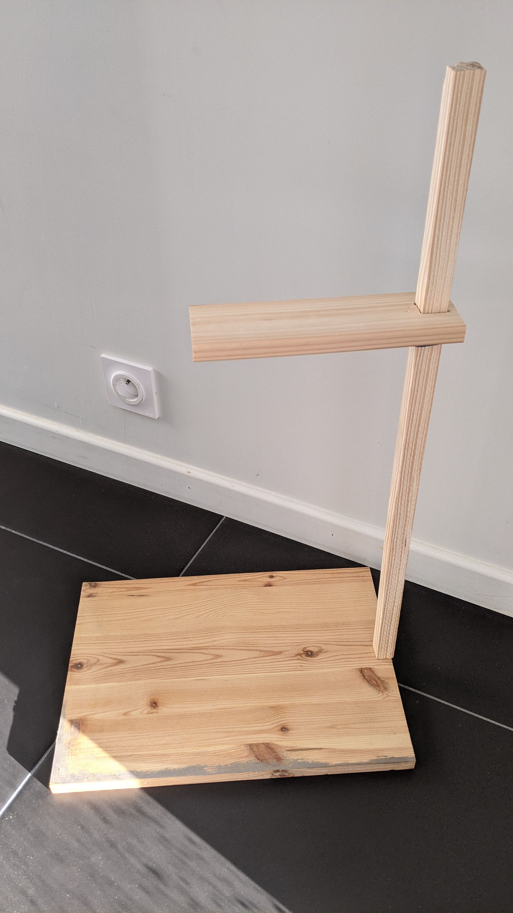
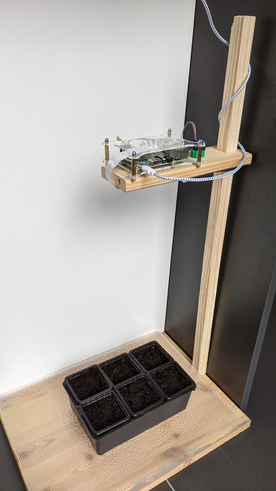

# `#growlab` app for Raspberry Pi

Record a timelapse and live preview image with sensor data from a DHT22 temperature and humidity sensor.


> The [@alexellisuk](https://twitter.com/alexellisuk) growlab preview

Inspired by the [Alex Ellis application](https://github.com/alexellis/growlab)

## Assembling the build

* You'll need a Raspberry Pi Zero W or any other Raspberry Pi.
* An RPi camera connected - any version

### Features [FR]

* Taking pictures at regular intervals
* Storage of photos for creation of a timelapse
* Publish the last picture on a github page

### Configuring the RPi

Using `raspi-config`

* Enable i2c under interfacing options
* Change the password for the `pi` user

### Getting started with the software

Install git :

```bash
sudo apt update -qy && \
  sudo apt install -qy git\
  python3 \
  python3-pip \
  python3-picamera2 \
  python3-tz \
  python3-smbus \
  python3-jinja2
```


Install the project

```bash
# clone project
git clone https://github.com/amouchere/growlab-project-v2

```


Install Python modules with `pip3`:

```bash
# DEPRECATED : use apt install python3-XXX 
sudo pip3 install -r requirements.txt
```

Capture a test image to determine if you need a horizontal or vertical flip or not:

```bash
# On the RPi
libcamera-still -o test.jpg

```

Edit the `config.json` (flip if needed, preview repository path ..)

Test the code:

```bash
python3 app.py
```

### Serve a preview with GitHub pages

Configure GitHub pages in your own repo

Set the folder for serving content to "root"

### Install the service 


```bash 
sudo cp ~/growlab-project/growlab-project.service /etc/systemd/system/growlab-project.service
sudo systemctl enable growlab-project.service
sudo systemctl start growlab-project.service
```

### Hardware 

Some pictures of my growlab installation.

* Reclaimed wood
* Raspberry pi V2 with Wifi USB Stick
* PI Camera
* On/Off Button for shutdown the PI without opening an ssh session



> The wood structure


> The growlab
